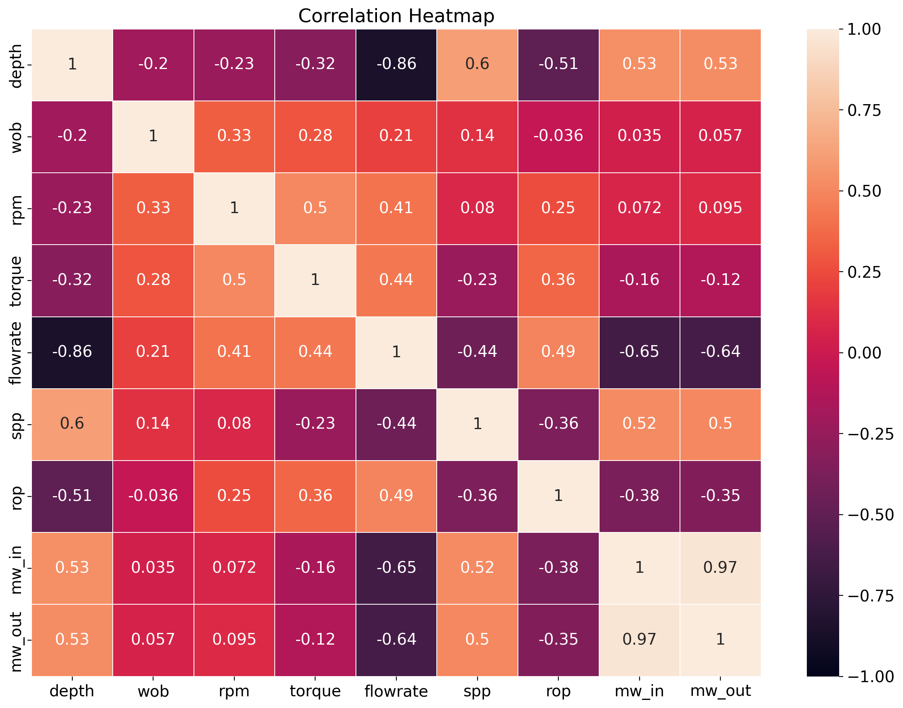

# ROP Estimation Pipeline

[]()
[]()
[]()
[]()

A production-style machine learning pipeline for estimating **Rate of
Penetration (ROP)** from drilling parameters data.

------------------------------------------------------------------------

## 📌 Project Title & Description

### What is this project?

The **ROP Estimation Pipeline** is a modular machine learning workflow
designed to estimate ROP from drilling parameters log data using multiple
regression models. This prediction could be useful to optimize the drilling operation.

### What problem does it solve?

-   Noisy sensor data\
-   Missing values\
-   Complex feature relationships

This pipeline automates cleaning, imputation, modelling, and evaluation.

### Who is it for?

-   Data scientists\
-   Drilling Engineers working with rig data\
-   ML practitioners building pipelines

------------------------------------------------------------------------

## ▶️ Usage / Example

### Run the pipeline

``` bash
python rop_estimation_pipeline_log.py
```

### Python usage

``` python
from rop_estimation_pipeline_log import main

artifacts = main()
print(artifacts["excel_path"])
```

### Access predictions

``` python
results = artifacts["results"]
print(results["gbr"].y_pred[:5])
```

------------------------------------------------------------------------

## ⚙️ Configuration

``` python
main(
    csv_path="data/DrillingParameters.csv",
    plots_dir="outputs/plots",
    results_excel_path="outputs/model_results.xlsx",
    log_file="outputs/logs/rop_pipeline.log",
)
```

### Required inputs

-   CSV dataset
-   Required columns:
    - `wellname`  
    - `bitsize` (unit: *inches*)  
    - `torque` (unit: klbf·in or k.lbm)  
    - `rop` (rate of penetration — *target variable*)  
    - `spp` (standpipe pressure, *psi*)  
    - `rpm` (drill string rotations per minute)  
    - `mw_in` (mud weight in)  
    - `mw_out` (mud weight out — may be redundant)  
    - `flowrate` (mud flow rate, *gpm*)  
    - `wob` (weight on bit, unit: *klbf* or lbf) 

------------------------------------------------------------------------

## 📊 Outputs

-   Excel results → outputs/model_results.xlsx\
-   Logs → outputs/logs/rop_pipeline.log\
-   Plots → outputs/plots/

------------------------------------------------------------------------

## 📸 Sample Visual

### Example Outputs




------------------------------------------------------------------------

## 🧠 How to Interpret Results

-   High R² → better model\
-   Low RMSE → fewer large errors\
-   Small train-test gap → good generalization

------------------------------------------------------------------------

## Installation

``` bash
pip install numpy pandas scikit-learn scikit-optimize shap openpyxl tensorflow keras
```

------------------------------------------------------------------------

## Project Structure

    .
    ├── rop_estimation_pipeline_log.py
    ├── visualizations.py
    ├── data/
    ├── outputs/
    └── README.md

------------------------------------------------------------------------

## License

MIT License
